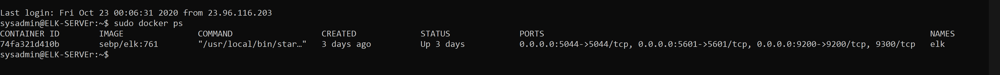

## Automated ELK Stack Deployment

The files in this repository were used to configure the network depicted below.


These files have been tested and used to generate a live ELK deployment on Azure. They can be used to either recreate the entire deployment pictured above. Alternatively, select portions of the YAML file may be used to install only certain pieces of it, such as Filebeat.
```
---
# install_elk.yml
- name: Configure Elk VM with Docker
  hosts: elk
  remote_user: sysadmin
  become: true
  tasks:
    # Use apt module
    - name: Install docker.io
      apt:
        update_cache: yes
        name: docker.io
        state: present

      # Use apt module
    - name: Install pip3
      apt:
        force_apt_get: yes
        name: python3-pip
        state: present

      # Use pip module
    - name: Install Docker python module
      pip:
        name: docker
        state: present

      # Use command module
    - name: Increase virtual memory
      command: sysctl -w vm.max_map_count=262144

      # Use sysctl module
    - name: Use more memory
      sysctl:
        name: vm.max_map_count
        value: "262144"
        state: present
        reload: yes
        
      # Use docker_container module
    - name: download and launch a docker elk container
      docker_container:
        name: elk
        image: sebp/elk:761
        state: started
        restart_policy: always
        published_ports:
          - 5601:5601
          - 9200:9200
          - 5044:5044
          
```
This document contains the following details:
- Description of the Topology
- Access Policies
- ELK Configuration
  - Beats in Use
  - Machines Being Monitored
- How to Use the Ansible Build


### Description of the Topology

The main purpose of this network is to expose a load-balanced and monitored instance of DVWA, the D*mn Vulnerable Web Application.

Load balancing ensures that the application will be highly available, in addition to restricting inbound access to the network.

- **LOAD BALANCING:** This allows for high availability. Ensures that work to process incoming traffic is properly distributed between both load balancers.

- **JUMPBOX:** Allows for security to be managed outsude of managed devices, allowing to harden the system.

**Integrating an ELK server allows users to easily monitor the vulnerable VMs for changes to the file systems of the VM's on the network and system metrics. These metrics include CPU usage, attempted SSH logins, sudo escalation failures; etc.**

- **Filebeat:** Collects data abou the file system.
- **Metricbeat** Collects machine metrics such as uptime. 

The configuration details of each machine may be found below.
_Note: Use the [Markdown Table Generator](http://www.tablesgenerator.com/markdown_tables) to add/remove values from the table_.

| Name                 | Function   | IP Address | Operating System |
| ---------------------|------------|------------|------------------|
| Jump Box Provisioner | Gateway    | 10.0.0.4   | Linux            |
| Web-1                | Web Server | 10.0.0.6   | Linux            |
| Web-2                | Web Server | 10.0.0.5   | Linux            |
| ELK                  | Monitoring | 10.1.0.4   | Linux            |

### Access Policies

The machines on the internal network are not exposed to the public Internet. 

Only the **jumpbox** machine can accept connections from the Internet. Access to this machine is only allowed from the following IP addresses:
- **216.188.246.50**

Machines within the network can only be accessed by **each other**.
- Which machine did you allow to access your ELK VM? What was its IP address?_
**The machine that was allowed acces to the ELK VM was the Jumpbox Provisioner. Its IP address is 10.0.0.4** 

A summary of the access policies in place can be found in the table below.

| Name     | Publicly Accessible | Allowed IP Addresses |
|----------|---------------------|----------------------|
| Jump Box | Yes                 | 216.188.246.50       |
| Web1     | No                  | 10.0.0.1/254         |
| Web2     | No                  | 10.0.0.1/254         |
| ELK      | No                  | 10.0.0.1/254         |

### Elk Configuration

Ansible was used to automate configuration of the ELK machine. No configuration was performed manually, which is advantageous because **it allows for accelerated and effecient automation.**

The playbook implements the following tasks:
- Install Docker.io
- Install pip3.
- Install Docker python module.
- Increase virtual memory.
- Downloand and launch docker. 

The following screenshot displays the result of running `docker ps` after successfully configuring the ELK instance.



#docker_ps_output

### Target Machines & Beats
This ELK server is configured to monitor the following machines: 
- Web-1: 10.0.0.6
- Web-2: 10.0.0.5

We have installed the following Beats on these machines:
- Filebeat
- Metricbeat

These Beats allow us to collect the following information from each machine:

**File Beat:** Detects changes to the file system, specifically to collect Apache logs.

**Metric Beat:** Detects changes in system metrics, such as CPU usage. We use it to detect SSH login attemps, failed sudo escalations, and CPU/RAM statistics. 

**Packet Beat:** Packetbeat collects packets that pass through the NIC, similar to wireshark. We use it to generate a trace of all activity that takes place on the network, in case later forensic analysis should be warranted. (Was not installed on the machines)


### Using the Playbook
In order to use the playbook, you will need to have an Ansible control node already configured. Assuming you have such a control node provisioned: 

SSH into the control node and follow the steps below:
- Copy the **playbook** file to **ansible control node.**
- Update the **host** file to include...**webserbver and elk selver**
- Run the playbook, and navigate to **kibana (http://[hostip]/app/kibana#/home)** ** to check that the installation worked as expected.

_TODO: Answer the following questions to fill in the blanks:_
- _Which file is the playbook? Where do you copy it?_
- _Which file do you update to make Ansible run the playbook on a specific machine? How do I specify which machine to install the ELK server on versus which to install Filebeat on?_
- _Which URL do you navigate to in order to check that the ELK server is running? **kibana (http://[hostip]/app/kibana#/home)** 

_As a **Bonus**, provide the specific commands the user will need to run to download the playbook, update the files, etc._
